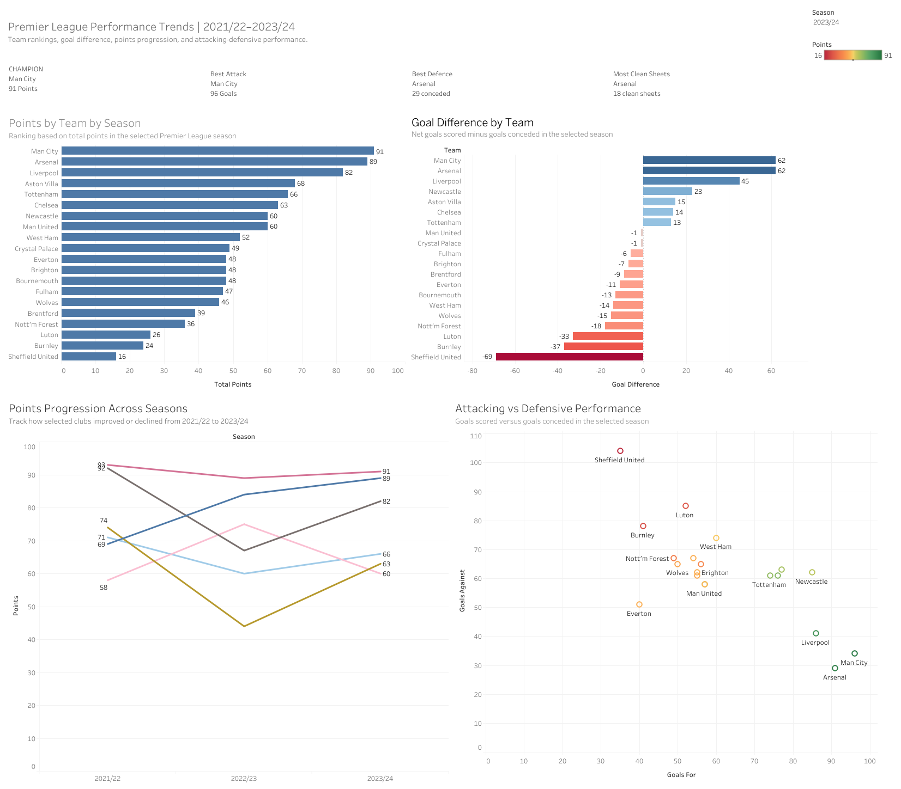

# Premier League Multi-Season Performance Analytics

## Project Overview

This project analyzes Premier League team performance across the 2021/22, 2022/23, and 2023/24 seasons.

Raw match-level datasets were cleaned and transformed into team-level metrics for analyzing points, goal difference, attacking and defensive performance, and changes across seasons.

## Dashboard Preview

## Interactive Dashboard

View the interactive dashboard on Tableau Public:

[Open Tableau Public Dashboard](https://public.tableau.com/app/profile/parth.nag7346/viz/AnalysisofPremeirLeagueacross3seasonsaa/PremierLeaguePerformanceTrends202122202324)

## Key Features

- Season-specific team points rankings
- Goal difference comparison
- Three-season points progression
- Attacking versus defensive performance
- Champion, best attack, best defense, and clean-sheet KPI cards
- Interactive season filtering

## Data Structure

The repository contains:

- `data/raw/` — original Premier League season datasets
- `data/processed/` — cleaned and transformed Tableau-ready data
- `tableau/` — packaged Tableau workbook
- `images/` — dashboard preview image

## Tools Used

- Tableau Public
- Microsoft Excel
- Data cleaning and transformation
- Data visualization
- Dashboard design

## Key Insights

- Manchester City recorded the highest points total in the 2023/24 season.
- Arsenal matched Manchester City’s goal difference and recorded the strongest defensive performance.
- Liverpool showed a substantial recovery in points between 2022/23 and 2023/24.
- Strong defensive performance clearly separated the leading teams from lower-ranked clubs.

## Seasons Analyzed

- 2021/22
- 2022/23
- 2023/24
